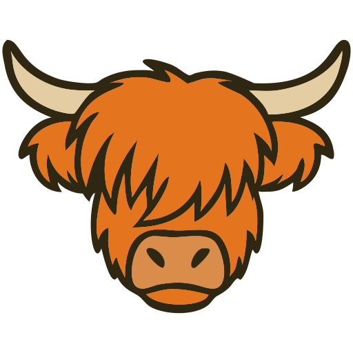
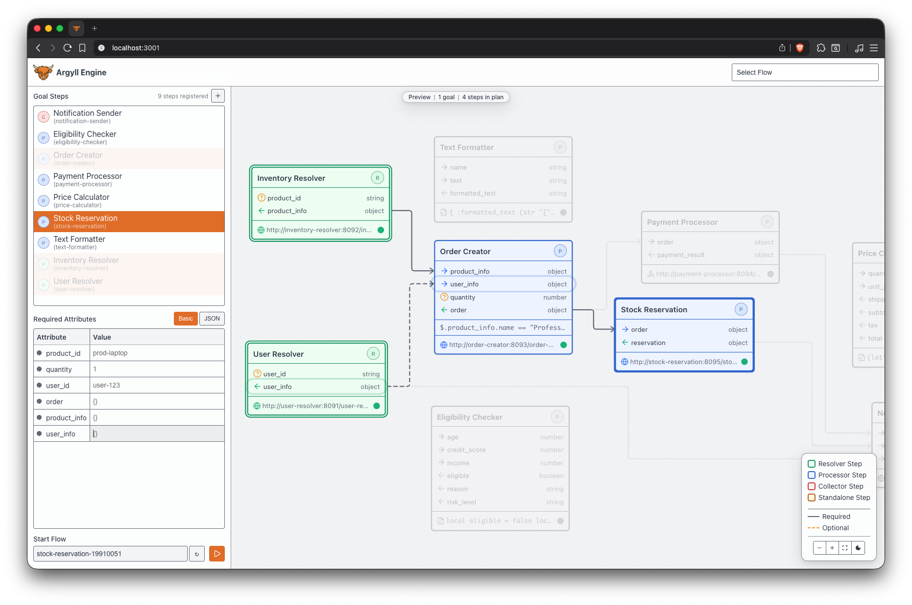

# Argyll 

### Goal-Driven Orchestrator

[](https://goreportcard.com/report/github.com/kode4food/argyll/engine) [](https://github.com/kode4food/argyll/actions) [](https://qlty.sh/gh/kode4food/projects/argyll) [](https://qlty.sh/gh/kode4food/projects/argyll) [](https://github.com/kode4food/argyll/blob/main/LICENSE.md)

Argyll is an orchestrator that uses goal-driven execution with lazy evaluation. Instead of running entire workflows, you specify what you want to achieve (one or more Goal Steps) and the engine automatically determines and executes only the minimal set of steps needed to accomplish its goals.



## Installation

```bash
# Using Docker Compose (recommended)
docker compose up

# Manual installation
go install github.com/kode4food/argyll/cmd/argyll@latest
```

## How It Works

Define steps that declare their input/output requirements. Create a flow by specifying one or more Goal Steps. The engine automatically:

1. Walks backward from the goals to build an execution plan
2. Determines which steps are actually needed
3. Executes only those steps in dependency order
4. Completes when all goals are reached

All state changes are stored as immutable events in Redis, enabling complete audit trails, state reconstruction, and real-time event streaming.

## Features

- Three step types: HTTP sync, HTTP async, or embedded scripts (Ale/Lua)
- Real-time UI with WebSocket updates
- Automatic health checks for HTTP steps
- Step retry with configurable backoff
- Multi-instance support

## API

```bash
# Steps
GET     /engine                 # Engine state (all steps)
GET     /engine/step/:stepID    # Get step
POST    /engine/step            # Register step
PUT     /engine/step/:stepID    # Update step
DELETE  /engine/step/:stepID    # Delete step

# Flows
GET     /engine/flow            # List flows
POST    /engine/flow            # Start flow
GET     /engine/flow/:flowID    # Get flow state

# Planning & Health
POST    /engine/plan            # Preview execution plan
GET     /engine/health          # All step health
GET     /engine/health/:stepID  # Step health

# Real-time
GET     /engine/ws              # WebSocket event stream
```

See `docs/api/engine-api.yaml` for full OpenAPI specification.

## Current Status

This is a work in progress. The basics are there, but not yet ready for production use. Use at your own risk.
