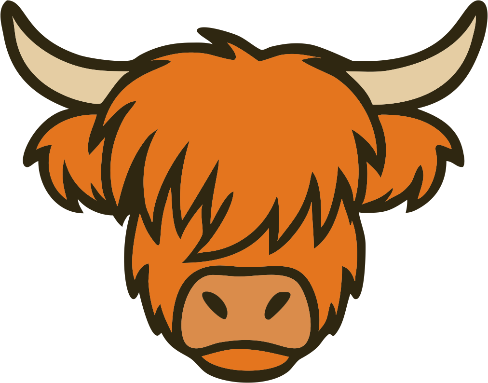

# Argyll 

### Goal-Driven Orchestrator

[](https://goreportcard.com/report/github.com/kode4food/argyll/engine) [](https://github.com/kode4food/argyll/actions) [](https://qlty.sh/gh/kode4food/projects/argyll) [](https://qlty.sh/gh/kode4food/projects/argyll) [](https://github.com/kode4food/argyll/blob/main/LICENSE.md)

Argyll is a goal-driven orchestrator. You declare what you want to achieve, the engine builds an execution plan, and it executes only the minimal set of steps needed. All state changes are immutable events, giving you a complete audit trail and deterministic recovery.


## Getting Started

```bash
# Start with Docker Compose
docker compose up
# Engine: http://localhost:8080
# UI: http://localhost:3001
```

**New to Argyll?** Start here:
1. [Quickstart](docs/quickstart.md) - 5-minute end-to-end example
2. [Core Concepts](docs/concepts/index.md) - Goals, steps, flows, events
3. [Full Documentation](docs/README.md) - Complete docs map

## How It Works

1. **Define steps** with inputs and outputs
2. **Create a flow** by specifying goal steps
3. **Engine computes** the minimal execution plan
4. **Execute and audit** - all state changes recorded as events

```
Goal: [process_payment, send_notification]
     ↓
Execution Plan: lookup_customer → process_payment
               check_inventory → reserve_stock → send_notification
     ↓
Result: Events recorded, flow auditable, recovery automatic
```

## Key Features

- **Event Sourcing**: Complete audit trail, deterministic recovery
- **Lazy Evaluation**: Execute only what's needed to reach goals
- **Multi-Instance**: Horizontal scaling with optimistic concurrency
- **Real-Time UI**: WebSocket updates, live flow monitoring
- **Four Step Types**: Sync/Async HTTP, Scripts (Ale/Lua), Sub-flows
- **Built-In Retry**: Configurable backoff strategies
- **Flow Archiving**: Automatic archiving of completed flows

## Installation

```bash
# Docker Compose (all services)
docker compose up

# Go
go install github.com/kode4food/argyll/cmd/argyll@latest

# Manual local testing
export ENGINE_REDIS_ADDR=localhost:6379
go run ./cmd/argyll
```

## API Overview

Full OpenAPI spec: [docs/api/engine-api.yaml](docs/api/engine-api.yaml)

```bash
# Steps
POST   /engine/step              # Register step
GET    /engine/step/:stepID      # Get step
PUT    /engine/step/:stepID      # Update step
DELETE /engine/step/:stepID      # Delete step
GET    /engine                   # List all steps

# Flows
POST   /engine/flow              # Start flow
GET    /engine/flow/:flowID      # Get flow state
GET    /engine/flow              # List flows
POST   /engine/plan              # Preview execution plan

# Health & Events
GET    /engine/health            # Step health
GET    /engine/ws                # WebSocket events
```

## Documentation

- **[Getting Started](docs/)** - Quickstart, dev setup, concepts
- **[How-To Guides](docs/guides/)** - Step types, parallelism, predicates, configuration
- **[Go SDK](docs/go/)** - Building steps in Go
- **[API Reference](docs/api/)** - OpenAPI specs and curl examples
- **[Examples](examples/)** - 7 runnable example steps

## Status

Work in progress. Core features stable. Not yet production-ready. Use at your own risk.

## License

MIT
