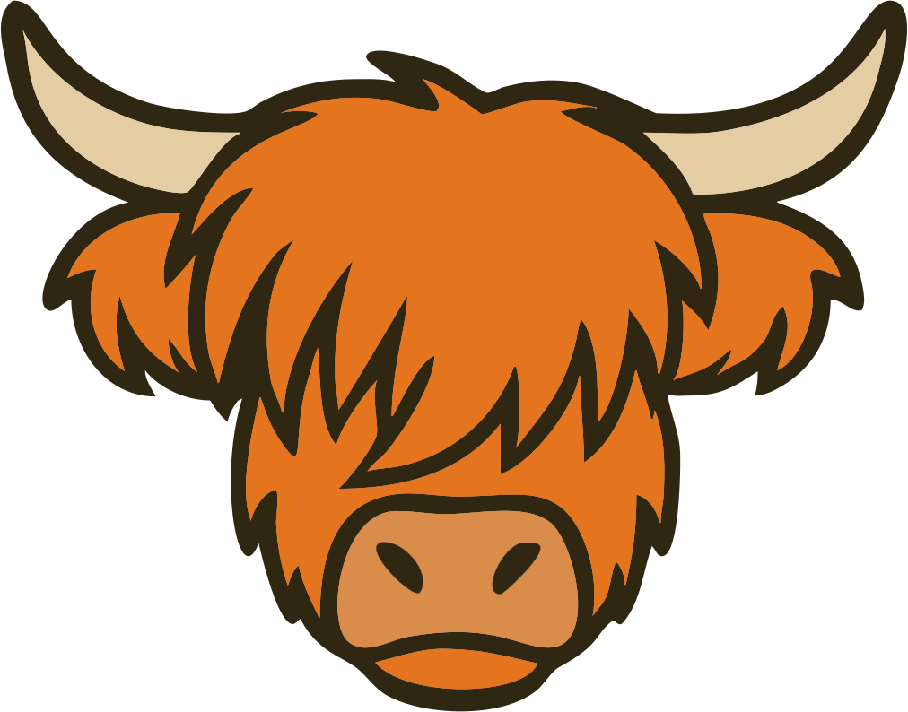
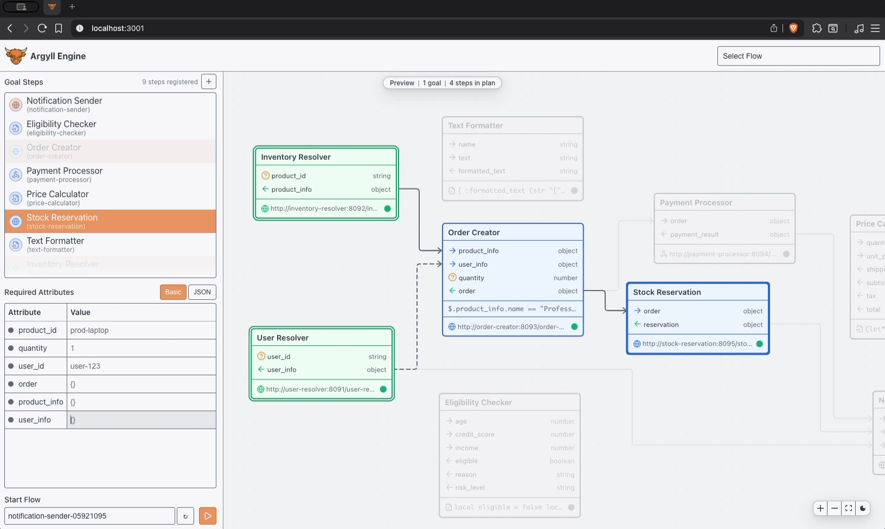

# Argyll 

### Goal-Driven Orchestrator

[](https://github.com/kode4food/argyll/actions) [](https://qlty.sh/gh/kode4food/projects/argyll) [](https://qlty.sh/gh/kode4food/projects/argyll) [](https://github.com/kode4food/argyll/blob/main/LICENSE)

Argyll is a goal-driven orchestrator. It builds the minimum execution plan needed to reach a Flow's Goals. Steps declare named inputs and outputs; Argyll connects them, runs independent work in parallel, and records every state change for recovery and inspection.



## Run Argyll

```bash
docker compose up
```

The engine is available at `http://localhost:8080` and the UI at `http://localhost:3001`.

## Documentation

- [Quick Start](https://www.argyll.app/docs/getting-started/quickstart/)
- [Concepts and Guides](https://www.argyll.app/docs/)
- [Go SDK](https://www.argyll.app/docs/sdks/go/)
- [Python SDK](https://www.argyll.app/docs/sdks/python/)
- [Project development and API specifications](docs/)

Argyll is under active development. Core flow execution, retries, async work, memoization, compensation, SDKs, and the web UI are available today.
